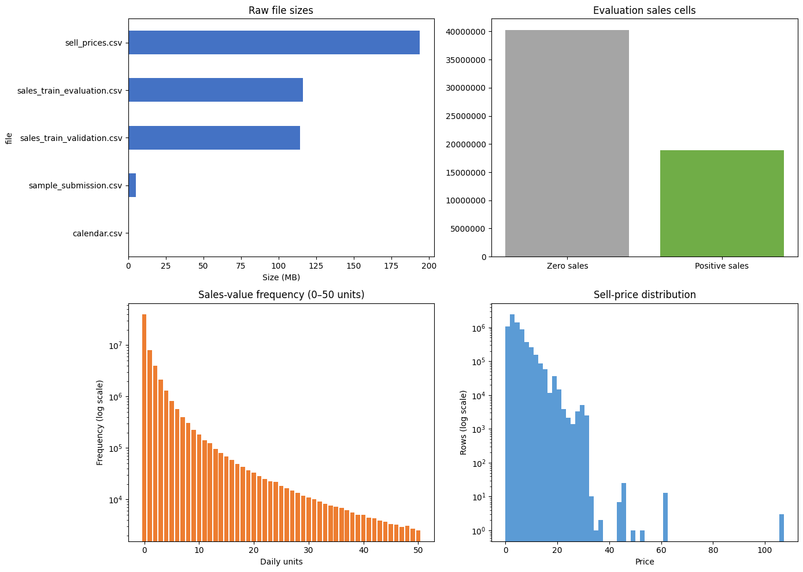
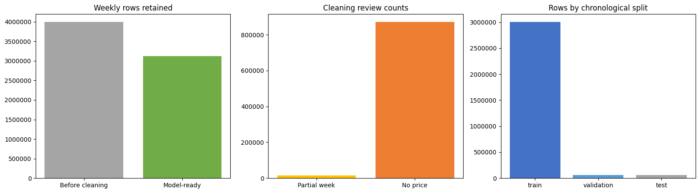
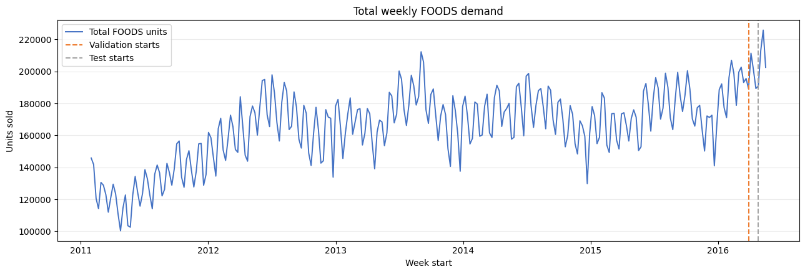
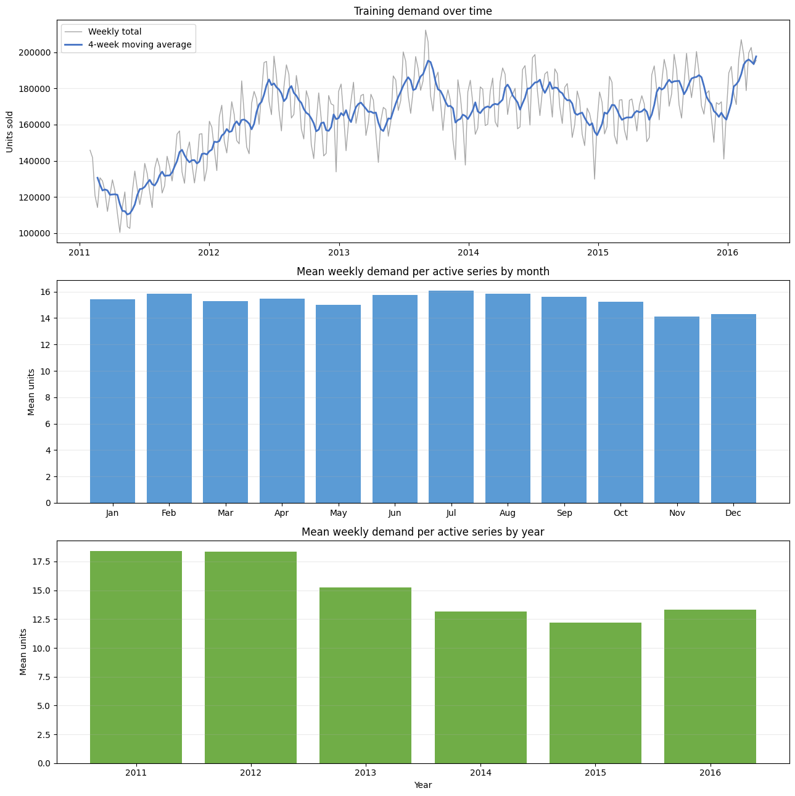
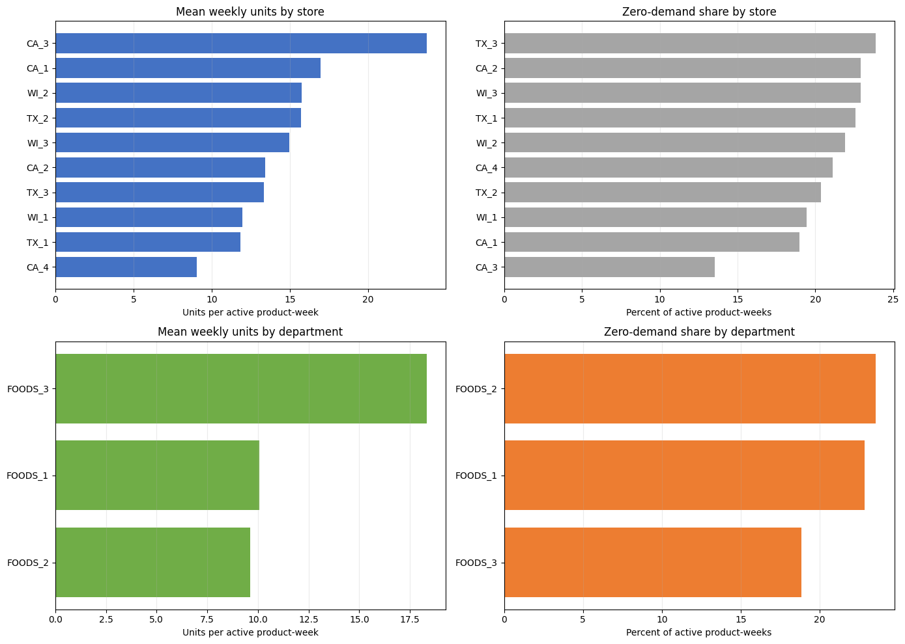
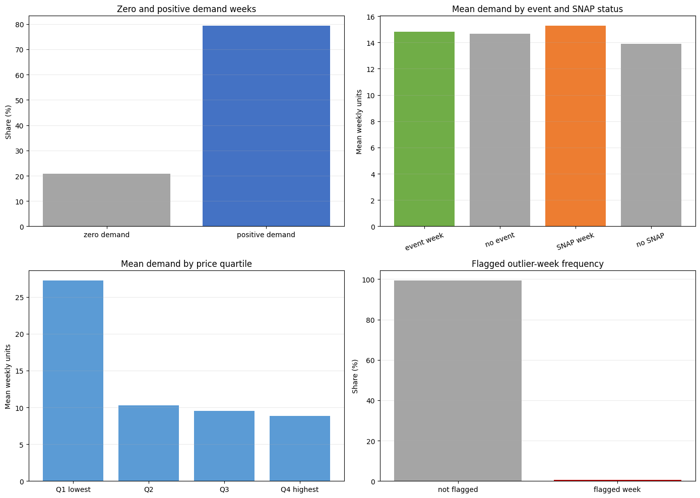
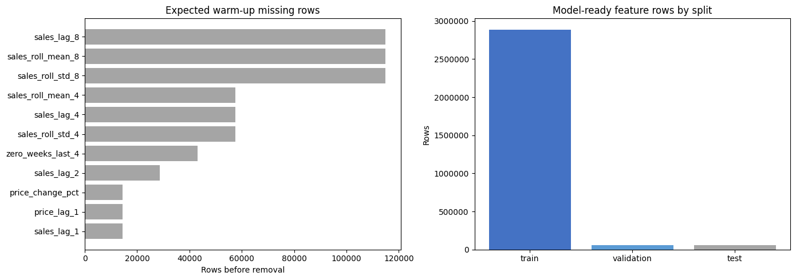
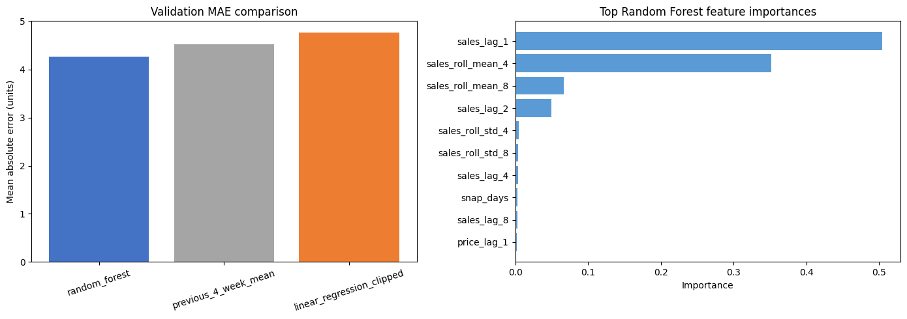
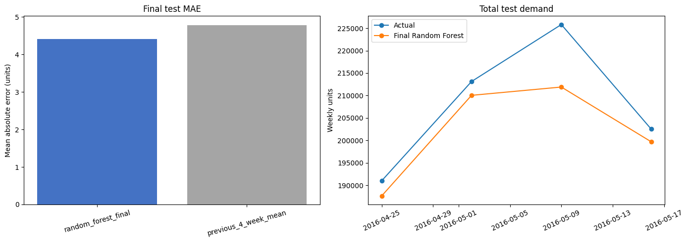
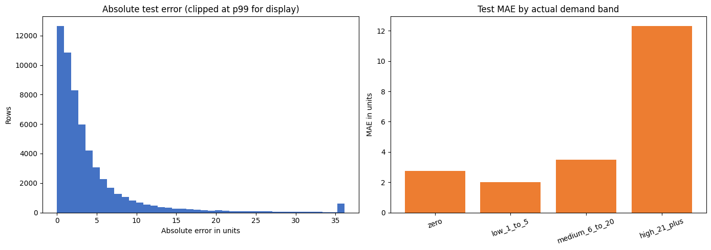

# Retail Demand Forecasting

## Полный пошаговый гайд по проекту и защите

**Студент:** Nosirov Nodir

**Группа:** Tulpar

**Трек:** Field-Based Scenario

**Сценарий:** RET-01 — Product Demand Forecasting

**Область:** RetailTech

**Репозиторий:** https://github.com/intelNod/retail-demand-forecasting

**Версия гайда:** 01.08.2026

---

## Как пользоваться этим документом

Этот гайд нужен не для механического заучивания. Его цель — помочь понять,
что именно сделано в проекте, почему каждый шаг был нужен и как это объяснить
преподавателю простыми словами.

Рекомендуемый порядок подготовки:

1. Сначала прочитать разделы 1–4 и научиться объяснять задачу и данные.
2. Затем разобрать notebooks 01–07: аудит, очистку, EDA и признаки.
3. После этого понять baseline, Linear Regression, Random Forest и MLflow.
4. Отдельно потренировать объяснение leakage, validation и test — это одна из
   самых важных частей проекта.
5. Запустить demo и API по инструкции из раздела 19.
6. В конце пройти вопросы из раздела 27, не глядя в ответы.

В документе используются четыре повторяющихся блока:

- **Что сделали** — фактическое действие в проекте.
- **Зачем** — причина, по которой шаг нужен.
- **Что получилось** — проверенный результат.
- **Как объяснить на защите** — готовая естественная формулировка.

> Важно: исходные M5-файлы прошли полный аудит без технических нарушений.
> Нельзя утверждать, что в них были найдены и исправлены выдуманные битые даты,
> отрицательные продажи или дубликаты. Реальная очистка проекта — это
> преобразование структуры, обработка ожидаемых пустых событий, исключение
> неполных и неактивных недель, типизация и проверка качества.

## Содержание по блокам

- **Постановка и данные:** разделы 1–7.
- **EDA, признаки и моделирование:** разделы 8–18.
- **Модель как решение:** разделы 19–22.
- **Требования, Git и демонстрация:** разделы 23–25.
- **Защита и проверка готовности:** разделы 26–32.

Названия разделов совпадают с этапами проекта, поэтому нужное место можно
быстро найти поиском по номеру notebook или термину.

---

# 1. Проект за 90 секунд

Проект прогнозирует, сколько единиц конкретного товара категории FOODS может
быть продано в конкретном магазине на следующей полной неделе.

Пользователь результата — retail inventory planner, то есть специалист,
который планирует запас. Прогноз помогает ему принять решение, но модель сама
не размещает заказ.

Используется большой открытый набор M5 Forecasting — Accuracy с историей
Walmart в США. Он содержит продажи, цены, календарь, праздники, события и
признаки SNAP. Полный проект проходит путь от пяти исходных CSV до работающего
web-интерфейса:

1. исходные файлы проверяются и остаются неизменными;
2. данные FOODS переводятся из дневного wide-формата в недельный long-формат;
3. выполняется train-only EDA;
4. данные делятся по времени на train, validation и test;
5. создаются признаки только из информации, известной до прогнозируемой недели;
6. строится простой baseline;
7. Linear Regression и Random Forest сравниваются на validation;
8. Random Forest фиксируется как победитель;
9. модель один раз оценивается на test;
10. ошибки анализируются без нового обучения;
11. сохранённая модель подключается к функции инференса, Flask API, UI и Colab
    demo.

Итоговый Random Forest получил test MAE **4.4179** против **4.7874** у baseline.
Это улучшение MAE на **7.72%**. При этом анализ ошибок показал, что недели с
высоким спросом сложнее: для фактических продаж 21+ единиц MAE равно **12.33**,
а среднее недопредсказание — **5.10** единицы. Поэтому правильный вывод —
использовать модель как поддержку решения с human review.

### Короткая устная версия

> Я сделал модель недельного прогноза спроса для FOODS-товаров. Сначала я
> проверил все исходные M5-файлы, затем преобразовал почти 28 миллионов дневных
> значений в недельные наблюдения и создал временное разделение без случайного
> перемешивания. Все lag и rolling-признаки используют только прошлые недели.
> На validation я сравнил baseline, Linear Regression и Random Forest. Random
> Forest оказался лучшим, поэтому я зафиксировал его параметры, переобучил на
> train плюс validation и один раз проверил на test. Он улучшил MAE baseline на
> 7.72%. Я также сделал MLflow tracking, error analysis, проверяемую функцию
> прогноза, Flask API, UI и чистый Colab demo.

---

# 2. Основные термины простыми словами

## 2.1 Наблюдение

Одна строка модельной таблицы — одна пара `store_id + item_id` за одну неделю.
Например: товар `FOODS_3_090` в магазине `CA_1` за неделю, начавшуюся в
понедельник.

## 2.2 Target

Target — правильный ответ, который модель учится прогнозировать. В проекте это
`weekly_units_sold`, то есть количество проданных единиц за неделю.

## 2.3 Feature

Feature — входной признак. Например, продажи за прошлую неделю, средняя цена,
месяц или количество SNAP-дней.

## 2.4 Regression

Regression — задача предсказания числа. Здесь ответ может быть `10.4885`, а не
класс вроде «высокий» или «низкий» спрос.

## 2.5 Time series

Time series — данные, где порядок времени имеет значение. Будущее нельзя
случайно смешивать с прошлым.

## 2.6 Train, validation и test

- **Train** используется для обучения параметров модели.
- **Validation** используется для сравнения подходов и выбора модели.
- **Test** открывается один раз после выбора и оценивает итоговую
  обобщающую способность.

## 2.7 Data leakage

Leakage — ситуация, когда модель во время обучения или прогноза получает
информацию, которой в реальности ещё не было. Например, если при прогнозе
продаж текущей недели в rolling mean случайно попадут продажи этой же недели.

## 2.8 Baseline

Baseline — простой понятный метод, который сложная модель обязана победить.
Иначе усложнение не даёт доказанной пользы.

## 2.9 Outlier

Outlier — необычно большое или маленькое значение. Это кандидат на проверку,
а не автоматически ошибка. Большая продажа может быть настоящим результатом
праздника или акции.

## 2.10 MAE

MAE — средняя абсолютная ошибка. MAE 4.42 означает, что модель в среднем
ошибается примерно на 4.42 единицы товара на одну товарно-магазинную неделю.

## 2.11 RMSE

RMSE тоже измеряет ошибку, но сильнее штрафует крупные промахи. Поэтому он
помогает увидеть тяжёлый хвост ошибок.

## 2.12 MLflow

MLflow — журнал экспериментов. Он сохраняет параметры, метрики, отчёты,
версию модели и позволяет проверить, что сохранённая модель даёт тот же
результат после повторной загрузки.

## 2.13 Inference

Inference — применение уже обученной модели к новым входным значениям.
Обучение в этот момент не происходит.

## 2.14 REST API

REST API — HTTP-интерфейс, через который другая программа или браузер отправляет
JSON и получает JSON с прогнозом.

---

# 3. Бизнес-задача и границы проекта

## 3.1 Какую проблему решаем

Розничному магазину нужно заранее оценить спрос. Слишком маленький запас может
привести к stockout — товар закончится. Слишком большой запас создаёт расходы,
замораживает деньги и для продуктов может увеличить списания.

Формальный вопрос проекта:

> Можно ли по прошлым продажам, недавней цене и заранее известной календарной
> информации улучшить недельный прогноз спроса относительно простого среднего
> за четыре прошлые недели?

## 3.2 Кто stakeholder

Stakeholder — retail inventory planner. Он может использовать прогноз вместе с
информацией об остатках, сроках поставки, минимальной партии и промо-планом.

## 3.3 Что прогнозируется

- один существующий FOODS-товар;
- в одном существующем магазине;
- на одну следующую полную неделю;
- единица результата — units per week.

## 3.4 Что не входит в проект

- автоматическое размещение заказа;
- прогноз для бензина, нефти или финансовых активов;
- новые товары без восьми недель истории;
- production hosting, авторизация и база пользователей;
- гарантированный прогноз для Узбекистана;
- prediction interval или вероятность каждого значения;
- оптимизация запасов с учётом стоимости stockout и overstock.

## 3.5 Почему FOODS, а не все категории

Полный M5 содержит HOBBIES, HOUSEHOLD и FOODS. Категория FOODS выбрана потому,
что она соответствует grocery retail, имеет 1,437 товаров во всех десяти
магазинах и даёт почти 28 миллионов дневных значений. Это крупный, но ещё
управляемый scope для курса. Ограничение категории — осознанное решение, а не
случайная маленькая выборка.

## 3.6 Почему не бензин и нефть

Бензин и нефть относятся к другому бизнес-процессу, другим драйверам спроса и
другой структуре данных. Сценарий RET-01 — retail product demand forecasting,
поэтому grocery FOODS соответствует теме напрямую.

### Как объяснить на защите

> Я ограничил scope полной категорией FOODS. Это 14,370 товарно-магазинных
> рядов, а не учебная выборка из нескольких товаров. Такой scope соответствует
> RetailTech-сценарию и позволяет пройти полный ML workflow без ухода в задачу
> нефтяного или финансового прогнозирования.

---

# 4. Почему выбран M5 и что находится в пяти файлах

Источник: M5 Forecasting — Accuracy, опубликованный на Kaggle. Данные относятся
к Walmart в California, Texas и Wisconsin за 2011–2016 годы.

## 4.1 `calendar.csv`

Содержит 1,969 последовательных календарных дней с 29.01.2011 по 19.06.2016.
Основные поля:

- `date` — реальная дата;
- `d` — внутренний номер дня M5;
- `wm_yr_wk` — код недели цены;
- `event_name_1/2`, `event_type_1/2` — события и праздники;
- `snap_CA`, `snap_TX`, `snap_WI` — SNAP по штатам.

Пустые event-поля означают обычный день без события. Это не техническая ошибка.

## 4.2 `sales_train_evaluation.csv`

Основная полная история продаж:

- 30,490 товарно-магазинных рядов;
- 1,941 дневная колонка `d_1`–`d_1941`;
- 59,181,090 дневных значений;
- иерархия `item`, `department`, `category`, `store`, `state`.

Именно этот файл используется для очистки и построения собственной временной
схемы train/validation/test.

## 4.3 `sales_train_validation.csv`

Содержит ту же структуру, но только 1,913 дней. Полный аудит доказал, что он —
точный ранний prefix evaluation-файла. Поэтому эти два файла нельзя считать
двумя независимыми наборами или объединять: это продублировало бы историю.

## 4.4 `sell_prices.csv`

Содержит 6,841,121 строку недельных цен по ключу:

```text
store_id + item_id + wm_yr_wk
```

Диапазон цены — от 0.01 до 107.32. Недельные price-ключи M5 относятся к
интервалам Saturday–Friday, а проект использует Monday–Sunday, поэтому при
подготовке создаётся календарный мост.

## 4.5 `sample_submission.csv`

Содержит 60,980 строк и 28 колонок прогноза `F1`–`F28`. В этом capstone он
используется для проверки структуры и соответствия ID, а не для отправки
результата в Kaggle.

## 4.6 Почему исходные CSV не лежат в GitHub

Некоторые файлы больше стандартного лимита GitHub. Репозиторий хранит:

- пустую структуру `data/raw`, `data/interim`, `data/processed`;
- код и notebooks, которые повторяют обработку;
- SHA-256 каждого исходного файла;
- компактные CSV/JSON-отчёты;
- готовую финальную модель для demo.

Сами исходные файлы скачиваются после принятия правил Kaggle. Репозиторий их
не перераспространяет.

---

# 5. Архитектура папок и воспроизводимый маршрут

```text
data/raw/              неизменяемые исходные CSV
data/interim/          временные результаты преобразования
data/processed/        очищенные weekly и feature Parquet
notebooks/             последовательность 01–12
reports/               проверяемые CSV/JSON-результаты
models/final_model/    автономный финальный MLflow/skops артефакт
src/                   validation, inference, Flask API и UI
tests/                 18 автоматических тестов
examples/              полный JSON-пример запроса
demo.ipynb             короткая чистая демонстрация
submission/            материалы LMS и защиты
```

## 5.1 Почему есть notebooks и reports

Notebook показывает ход анализа и визуализации. Report сохраняет ключевой
результат в маленьком файле. Преподаватель может быстро проверить числа, не
пересчитывая три миллиона строк.

## 5.2 Почему raw, interim и processed разделены

- `raw` можно повторно проверить и сравнить по hash;
- `interim` можно удалить и пересоздать;
- `processed` содержит только результат документированных правил;
- ни один этап не перезаписывает источник.

## 5.3 Роль Git и GitHub

Git фиксирует небольшие законченные шаги: аудит, очистку, EDA, признаки,
baseline, модели, API и финализацию. GitHub является историей проекта и местом,
откуда преподаватель получает код и demo.

После финальной загрузки в LMS новые commits делать нельзя: по условию курса
это может считаться late submission.

## 5.4 Роль Colab

Colab удобен для просмотра и короткого demo. Полный workflow требует загрузки
M5 CSV и заметной памяти, поэтому не следует обещать, что всё обучение быстро
запустится в бесплатной сессии. Корневой `demo.ipynb` специально отделён от
полного обучения и работает только с опубликованной моделью.

---

# 6. Notebook 01 — полный аудит исходных данных

## 6.1 Цель аудита

До очистки нужно понять реальные проблемы данных. Удалять строки только потому,
что значение выглядит необычным, нельзя.

## 6.2 Что проверялось

### Файлы и целостность

- наличие всех пяти CSV;
- размер файлов;
- SHA-256;
- ожидаемые колонки.

### Календарь

- `pd.to_datetime(..., errors="coerce")` выявляет неразбираемые даты;
- обязательные пропуски;
- дубликаты `date` и `d`;
- непрерывность дневной последовательности.

### Продажи

Файлы слишком велики для неосторожной обработки, поэтому Pandas читает их
частями через `read_csv(..., chunksize=250)`.

Для 59,181,090 evaluation-значений и 58,327,370 validation-значений проверены:

- пропуски;
- нечисловые значения;
- отрицательные значения;
- дробные продажи;
- дубликаты series key;
- конфликты item→department/category и store→state;
- доля нулей;
- min, max и 99.9 percentile.

### Цены

Цены читаются chunks по 250,000 строк и проверяются на:

- пустые ключи;
- нечисловые и неположительные цены;
- неправильные недели;
- duplicate `store_id + item_id + wm_yr_wk`;
- диапазон и p99.9.

### Cross-file consistency

Проверено, что:

- дни продаж существуют в календаре;
- недели цен существуют в календаре;
- товары и магазины цен существуют в продажах;
- submission IDs соответствуют sales series;
- validation history полностью совпадает с началом evaluation history.

## 6.3 Что получилось

- calendar: 1,969 строк, 0 невалидных дат и дубликатов;
- evaluation sales: 30,490 рядов, 0 пропусков, отрицательных, дробных и
  нечисловых значений;
- validation sales: такие же нулевые technical issue counts;
- prices: 6,841,121 строк, 0 пустых, неположительных и duplicate ключей;
- submission: правильные `F1`–`F28`, 0 проблем;
- все 16 сводных audit checks — PASS.



*Рисунок 1. График сохранён в выполненном Notebook 01. Он показывает масштаб
файлов и реальные распределения; ноль доминирует, но остаётся валидным
значением.*

## 6.4 Нули и outliers

В evaluation sales 40,241,819 нулей, или 67.9978% дневных значений. Ноль может
означать отсутствие продажи в этот день, поэтому он остаётся частью спроса.

Порог p99.9 для дневных продаж равен 47. Значений выше порога — 57,465, max —
763. Они отмечаются для контекстной проверки, но не удаляются автоматически.

Для цены p99.9 равен 28.96, значений выше — 6,015. Высокая цена тоже не является
доказательством ошибки: разные товары имеют разные ценовые уровни.

## 6.5 Что сказать, если спросят «какие ошибки вы нашли?»

> Я искал технические ошибки во всём датасете, а не в маленьком sample. Полный
> аудит не обнаружил битых дат, отрицательных продаж, invalid prices или
> duplicate business keys. Но аудит выявил важные особенности: около 68%
> дневных продаж равны нулю, event-поля часто ожидаемо пусты, validation-файл
> является prefix evaluation-файла, а значения выше p99.9 требуют проверки,
> а не автоматического удаления. Поэтому моя очистка решает задачи структуры и
> моделирования, а не выдуманный ремонт повреждённых строк.

## 6.6 Входы и выходы

**Вход:** пять файлов из `data/raw`.

**Выход:**

- `reports/data_file_inventory.csv`;
- `reports/data_audit_summary.csv`;
- `reports/data_audit_findings.json`.

---

# 7. Notebook 02 — очистка и weekly preprocessing

## 7.1 Что означает «очистка» в этом проекте

Очистка включает:

- фильтрацию полного FOODS scope;
- преобразование типов;
- перевод wide daily sales в long weekly rows;
- согласование календарных и price weeks;
- явную обработку отсутствующего события как `No event`;
- сохранение нулевого спроса;
- маркировку, а не удаление outliers;
- исключение неполных и неактивных недель;
- проверки ключей и обязательных значений;
- запись новых Parquet без изменения raw CSV.

## 7.2 Подготовка календаря

Дата разбирается строго через `errors="raise"`. Начало недели вычисляется так:

```python
week_start = date - pd.to_timedelta(date.dt.dayofweek, unit="D")
```

Это даёт Monday. Затем по неделе агрегируются:

- `week_end`;
- число календарных дней;
- количество event days;
- SNAP days отдельно для CA, TX и WI;
- объединённые названия событий или `No event`.

## 7.3 Подготовка недельной цены

M5 price week не совпадает с Monday–Sunday проекта. Календарный bridge считает,
сколько дней каждого `wm_yr_wk` попадает в проектную неделю. Средняя цена
получается day-weighted:

```text
sum(price × covered_days) / sum(covered_days)
```

Также сохраняются min, max и coverage days. 3,181,789 FOODS price rows
превращаются в 3,124,309 недельных price rows.

## 7.4 Преобразование продаж

Файл читается частями по 500 series. Полный FOODS scope:

- 14,370 store-item series;
- 1,437 товаров;
- 27,892,170 дневных значений.

`pd.melt()` переводит wide-таблицу с колонками `d_1 ... d_1941` в long-вид:

```text
store + item + day + units_sold
```

Затем `groupby(...).agg()` создаёт недельную строку:

- `weekly_units_sold`;
- `days_observed`;
- `zero_sales_days`;
- `max_daily_sales`;
- `sales_outlier_days`.

После этого недельные продажи объединяются с календарём и ценой через merge с
явной проверкой cardinality (`many_to_one` и `one_to_one`).

## 7.5 Правила сохранения и исключения

- Нулевые недели **сохраняются**.
- Дневные продажи >47 **сохраняются и flag-ятся**.
- Пустое событие получает текст `No event`.
- Неполная неделя, где наблюдалось не семь дней, исключается.
- Неделя без цены исключается как период до активации или вне ассортимента.
- Проверка показала: missing price + positive sales = 0. Значит, из-за этого
  правила реальные положительные продажи не потеряны.
- Raw files никогда не перезаписываются.

## 7.6 Баланс строк

До правил было 3,994,860 недельных строк.

- partial weeks: 14,370;
- missing-price weeks: 870,551;
- всего исключено: 875,998;
- результат: 3,118,862 строки;
- zero-demand weeks: 634,398, или 20.3407%;
- weeks containing outliers: 20,907;
- duplicate output keys: 0;
- required output nulls: 0;
- сохранено 38 Parquet parts.



*Рисунок 2. Выполненный Notebook 02: до/после preprocessing, причины review и
распределение строк по времени.*

## 7.7 Временное разделение

| Split | Период | Строк до feature warm-up | Назначение |
|---|---:|---:|---|
| Train | 31.01.2011–27.03.2016 | 3,003,902 | обучение |
| Validation | 28.03.2016–24.04.2016 | 57,480 | сравнение методов |
| Test | 25.04.2016–22.05.2016 | 57,480 | итоговая проверка |
| Demonstration | 23.05.2016–29.05.2016 | target недоступен | пример будущего прогноза |

## 7.8 Почему используется Parquet

Parquet хранит типы, сжимает данные и позволяет PyArrow читать только нужные
колонки и splits. Для таблицы на миллионы строк это эффективнее CSV.

### Как объяснить на защите

> Я не изменял исходные CSV. Я chunk-ами отфильтровал полную FOODS-категорию,
> сделал long weekly representation, согласовал цену с Monday–Sunday неделей,
> сохранил нули и настоящие spikes, исключил только неполные недели и периоды
> без цены, где не было положительных продаж. После очистки осталось 3.119
> миллиона строк с нулём duplicate keys и required nulls.

---

# 8. Что такое EDA и почему он выполняется только на train

EDA — exploratory data analysis, то есть исследование данных до обучения
модели. Его задача — понять масштабы, распределения, временные изменения и
различия между группами.

После определения splits подробные закономерности target изучаются только на
train. Если постоянно смотреть на validation и test, аналитик начинает
неосознанно подстраивать решения под будущие периоды.

В проекте EDA разделён на четыре небольших notebook. Это позволяет объяснить
каждый вопрос отдельно и сохранить результаты отдельными отчётами.



*Рисунок 3. Общая временная картина используется для ориентации; детальный
target-анализ выполняется на train.*

---

# 9. Notebook 03 — общий EDA overview

## 9.1 Как данные читаются

PyArrow открывает набор из 38 Parquet parts как один dataset. Он умеет считать
строки, distinct значения и aggregates без постоянного копирования повторяющихся
строковых identifiers в Pandas.

## 9.2 Размер модельного weekly dataset

- 3,118,862 строки;
- 1,437 продуктов;
- 3 FOODS departments;
- 10 stores;
- 3 states;
- 277 недель;
- период 31.01.2011–22.05.2016.

## 9.3 Различия splits до feature warm-up

| Split | Строк | Средний weekly demand | Max | Zero share |
|---|---:|---:|---:|---:|
| Train | 3,003,902 | 14.7319 | 3,976 | 20.7178% |
| Validation | 57,480 | 13.7601 | 862 | 12.3434% |
| Test | 57,480 | 14.4831 | 938 | 8.6291% |

Эти различия важны: будущие четыре недели не обязаны иметь точно такое же
распределение, как многолетний train.

## 9.4 Главный вывод

Weekly demand заметно меняется во времени. Поэтому random split, где будущие и
прошлые строки перемешаны, создавал бы слишком оптимистичную оценку.

### Как объяснить

> На overview я проверил, что обработанный dataset полный: 1,437 продуктов,
> десять магазинов и 277 недель. Я также увидел изменение demand и zero share
> между временными splits. Это подтвердило, что нужна хронологическая, а не
> случайная оценка.

---

# 10. Notebook 04 — спрос во времени

## 10.1 Ограничение данных

Notebook загружает через PyArrow filter только 3,003,902 train rows и 269 train
weeks. Validation и test targets не читаются.

## 10.2 Что рассчитывается

- total units по неделе;
- mean units per active series;
- число active series;
- 4-week moving average;
- month и year aggregates;
- min, max и начало/конец периода.

Четырёхнедельная moving average строится через `rolling(window=4)` и сглаживает
короткий шум для визуального анализа. Это ещё не прогноз модели.

## 10.3 Проверенные находки

- strongest month: July, среднее 16.0647 единицы на active series;
- weakest month: November, 14.1088;
- peak total demand week: 02.09.2013, 212,307 единиц;
- lowest total demand week: 25.04.2011, 100,337;
- среднее последних восьми train-недель на 33.90% ниже первых восьми.

Средний weekly demand по годам уменьшался: примерно 18.40 в 2011, 18.34 в 2012,
15.24 в 2013, 13.14 в 2014, 12.19 в 2015 и 13.34 в части 2016.



*Рисунок 4. Выполненный Notebook 04. Важно различать weekly total и mean per
active series, поскольку ассортимент менялся.*

## 10.4 Почему нельзя сделать причинный вывод

Одновременно менялось количество active series и ассортимент. Поэтому падение
mean или рост total demand нельзя автоматически объяснить одним фактором.
EDA показывает association и подсказывает признаки, но не доказывает cause.

### Как объяснить

> Я сравнивал и total demand, и mean per active series, потому что ассортимент
> менялся. Временные patterns подтвердили пользу lag, rolling и calendar
> features, но я не выдаю эти описательные различия за причинные эффекты.

---

# 11. Notebook 05 — магазины и departments

## 11.1 Зачем анализировать группы

Одна общая MAE может выглядеть хорошо и скрывать плохое качество в конкретном
магазине или department. Поэтому EDA и финальная оценка содержат group reports.

## 11.2 Stores

- `CA_3` имеет highest mean weekly demand: 23.751;
- `CA_4` — lowest mean: 9.051;
- `TX_3` — highest zero-demand share: 23.879%.

## 11.3 Departments

- `FOODS_3` — highest mean: 18.3419;
- `FOODS_3` — highest total: 31,793,548 units;
- `FOODS_2` — highest zero share: 23.5568%.



*Рисунок 5. Train-only group EDA из Notebook 05.*

## 11.4 Как интерпретировать

Это описательные различия. Они не означают, что сам store ID вызывает спрос.
Различия могут отражать размер магазина, ассортимент, локальных покупателей,
цены и доступность товара.

### Как объяснить

> Я не ограничился общей средней. Я проверил все десять stores и три
> departments. Это позже позволило показать, что итоговая модель слабее всего
> на `WI_2` и `FOODS_3`, даже если overall MAE остаётся лучше baseline.

---

# 12. Notebook 06 — нули, события, SNAP, цены и outliers

## 12.1 Zero demand

В train 622,343 zero-demand weeks из 3,003,902, то есть 20.7178%. Это важная
часть поведения спроса, поэтому она не удаляется и не заменяется mean.

## 12.2 Events

- event-week mean: 14.7976;
- no-event mean: 14.6703.

Разница небольшая. Наличие event остаётся возможным feature, но само сравнение
не доказывает, что событие вызвало изменение.

## 12.3 SNAP

- SNAP-week mean: 15.2646;
- no-SNAP mean: 13.8819.

SNAP — американская программа продовольственной помощи. Это заранее известный
calendar factor в M5. Для другого рынка его нельзя переносить без изменения.

## 12.4 Price bands

Цена делится на четыре quantile-группы через `pd.qcut`. Низкий price band имеет
более высокий mean demand, но разные bands содержат разные товары. Поэтому
такой chart не является оценкой price elasticity.

## 12.5 Flagged outliers

В train 20,381 weekly rows содержат хотя бы один daily value >47. Это 0.6785%
train rows и 53,194 flagged daily values. Средний weekly demand flagged rows
равен 300.33 против 12.78 у non-flagged.

Эти rows сохраняются: удаление реальных high-demand weeks научило бы модель
игнорировать важный бизнес-риск.



*Рисунок 6. Train-only quality-factor EDA. Различия средних являются
association, а не причинным эффектом.*

### Как объяснить

> Я отдельно изучил нули, events, SNAP, price bands и flagged spikes. Я не
> заменял нули и не удалял outliers автоматически. EDA показал associations,
> которые можно проверять моделью на будущей validation, но не причинность.

---

# 13. Notebook 07 — leakage-safe feature engineering

## 13.1 Что модель знает в момент прогноза

Перед созданием каждого feature задаётся вопрос:

> Было бы это значение реально известно до начала прогнозируемой недели?

Допустимы:

- завершённые прошлые продажи;
- текущая плановая цена, если бизнес знает её заранее;
- заранее опубликованные события и календарь;
- SNAP calendar.

Недопустимы:

- продажи прогнозируемой недели;
- `has_sales_outlier` текущей недели;
- любые rolling statistics, включающие current target.

## 13.2 Непрерывность недель

`groupby().shift(1)` означает «прошлая неделя» только если соседние строки ряда
разделены ровно семью днями. До features проверены 3,104,492 within-series gaps;
все равны семи дням.

## 13.3 Четыре identifier-колонки

В feature table сохраняются:

- `item_id`;
- `dept_id`;
- `store_id`;
- `state_id`.

Они нужны для группировки, отчётов и traceability. Текущие модели обучаются на
20 numeric features, а не на этих IDs.

## 13.4 Двадцать numeric features

### История продаж

- `sales_lag_1`, `sales_lag_2`, `sales_lag_4`, `sales_lag_8`;
- `sales_roll_mean_4`, `sales_roll_std_4`;
- `sales_roll_mean_8`, `sales_roll_std_8`;
- `zero_weeks_last_4`.

### Цена

- `sell_price_mean`;
- `price_lag_1`;
- `price_change_pct`.

### Calendar и programs

- `year`, `month`, `week_of_year`, `quarter`;
- `event_days`, `has_event`;
- `snap_days`, `has_snap`.

## 13.5 Центральное правило `shift(1)`

Сначала создаётся прошлое значение:

```python
past_sales = grouped["weekly_units_sold"].shift(1)
```

И только потом rolling statistics:

```python
rolling_mean_4 = past_sales.rolling(4).mean()
```

Если сделать rolling по target до shift, текущий ответ попадёт во вход, что
создаст leakage.

## 13.6 Почему первые строки ряда удаляются

Для `lag_8` и 8-week rolling нужно восемь завершённых недель. Это называется
warm-up. Отсутствие истории здесь ожидаемо и не заполняется средним из будущего.

До/после warm-up:

| Split | До | После | Удалено |
|---|---:|---:|---:|
| Train | 3,003,902 | 2,888,944 | 114,958 |
| Validation | 57,480 | 57,478 | 2 |
| Test | 57,480 | 57,480 | 0 |

Две validation rows принадлежат поздно появившемуся product series, у которого
ещё нет восьми прошлых недель.



*Рисунок 7. Пропуски до warm-up ожидаемы: чем длиннее lag/rolling window, тем
больше начальных строк ещё не имеют истории.*

## 13.7 Sentinel leakage test

В одном sample series target выбранной недели временно увеличивается на
100,000. Затем features пересчитываются. Same-week features обязаны остаться
без изменений. Меняться могут только признаки будущих недель, где изменённое
значение уже стало историей.

Все восемь leakage/data checks проходят:

- continuous weeks;
- sentinel test;
- exact lag 1;
- target excluded;
- current outlier flag excluded;
- chronological order;
- zero duplicate keys;
- zero required nulls.

### Как объяснить leakage на простом примере

> Если я прогнозирую неделю 10, я могу использовать продажи недель 9, 8, 6 и
> 2, но не продажи недели 10. Поэтому сначала применяется shift(1), и только
> потом rolling. Я также изменил target одной недели на огромное число и
> проверил, что её собственные features не изменились.

---

# 14. Notebook 08 — baseline

## 14.1 Зачем нужен baseline

В retail demand последние недели часто сами по себе являются сильным прогнозом.
Если ML-модель не лучше такого метода, её сложность не оправдана.

## 14.2 Два baseline

1. **Previous week:** прогноз равен `sales_lag_1`.
2. **Previous 4-week mean:** прогноз равен `sales_roll_mean_4`.

Используется только validation: 57,478 rows и четыре недели. Test file не
загружается.

## 14.3 Формулы

Для строки ошибка определяется как:

```text
error = prediction - actual
```

```text
MAE  = mean(abs(error))
RMSE = sqrt(mean(error²))
Mean Error = mean(error)
```

Если Mean Error отрицательный, модель в среднем underpredicts. Если
положительный — overpredicts.

## 14.4 Результат

| Метод | Validation MAE | Validation RMSE | Mean Error |
|---|---:|---:|---:|
| Previous 4-week mean | **4.5172** | **10.1300** | -0.0255 |
| Previous week | 5.0310 | 10.5799 | +0.1087 |

Четырёхнедельное среднее становится официальным hurdle для моделей.

### Как объяснить

> Я сначала построил два простых прогноза. Среднее за четыре прошлые недели
> оказалось лучше одной прошлой недели, поэтому его MAE 4.517 стало числом,
> которое обученная модель должна победить на том же validation split.

---

# 15. Notebook 09 — Linear Regression и первый MLflow run

## 15.1 Почему начать с Linear Regression

Это быстрая, понятная модель. Она проверяет, достаточно ли линейной комбинации
20 features. Неудачный результат тоже является полезным экспериментом.

## 15.2 Pipeline

```python
Pipeline([
    ("scaler", StandardScaler()),
    ("regressor", LinearRegression(copy_X=False, n_jobs=-1)),
])
```

`StandardScaler` обучается только на train и приводит features к сопоставимому
масштабу. Затем Linear Regression ищет коэффициенты. 3,263 отрицательных raw
predictions обрезаются до нуля, потому что отрицательные продажи невозможны.

## 15.3 Результат

- train rows: 2,888,944;
- validation rows: 57,478;
- fit time: 2.35 s;
- validation MAE: 4.7662;
- validation RMSE: 10.5693;
- Mean Error: -0.2911;
- относительно baseline MAE хуже на 5.51%.

Модель не выбирается.

## 15.4 Почему коэффициенты не доказывают причинность

Lag и rolling features сильно correlated. Большой standardized coefficient
показывает роль в конкретной linear specification, но не означает причинный
эффект.

## 15.5 Что записывает MLflow

- имя experiment и run;
- параметры модели;
- число rows и features;
- MAE, RMSE, Mean Error и сравнение с baseline;
- fit/predict time;
- store/department reports;
- coefficients;
- model signature и input example;
- serialised model.

После записи модель загружается обратно, и reloaded MAE совпадает с original.

### Как объяснить

> Linear Regression была честным первым экспериментом. Она обучилась быстро,
> но MAE 4.766 оказалось хуже baseline 4.517. Я не скрывал этот результат и не
> выбирал более сложную модель заранее. MLflow сохранил параметры, метрики,
> artifacts и проверку повторной загрузки.

---

# 16. Notebook 10 — controlled Random Forest

## 16.1 Как работает Random Forest

Random Forest строит много decision trees на разных bootstrap samples и
усредняет их прогнозы. Trees умеют моделировать nonlinear thresholds и
interactions, которые Linear Regression не выражает напрямую.

## 16.2 Почему модель называется controlled

Scope курса не требует бесконечного hyperparameter search. Используется заранее
ограниченная reproducible configuration:

| Параметр | Значение | Смысл |
|---|---:|---|
| `n_estimators` | 40 | число trees |
| `max_depth` | 14 | ограничение глубины |
| `min_samples_leaf` | 20 | минимум rows в leaf |
| `max_features` | 0.7 | 70% features на split |
| `max_samples` | 0.5 | 50% train sample на tree |
| `bootstrap` | True | sampling с возвращением |
| `random_state` | 42 | повторяемость |
| `n_jobs` | -1 | все CPU cores |

Ограничения уменьшают overfitting и runtime.

## 16.3 Validation result

- fit time: 159.89 s;
- predict time: 0.0867 s;
- Random Forest MAE: **4.2698**;
- RMSE: **9.1372**;
- Mean Error: +0.1141;
- baseline MAE: 4.5172;
- improvement over baseline: **5.48%**;
- Linear Regression MAE: 4.7662.

Random Forest выбирается **до открытия test**.

## 16.4 Feature importance

На validation model главные features:

- `sales_lag_1`: 50.41%;
- `sales_roll_mean_4`: 35.15%;
- `sales_roll_mean_8`: 6.65%;
- `sales_lag_2`: 4.93%.

Feature importance означает predictive use внутри forest, а не причинность.
Calendar и price features могут иметь малую индивидуальную importance, потому
что recent demand уже содержит много информации и features correlated.



*Рисунок 8. Random Forest выигрывает на одной и той же validation; importance
показывает predictive use, но не causality.*

## 16.5 Проверки

Проходят 16 checks, включая:

- только train и validation;
- test не загружен;
- target исключён;
- 40 fitted trees;
- finite/non-negative predictions;
- importance sum = 1;
- row accounting;
- MLflow run FINISHED;
- reloaded model воспроизводит MAE.

### Как объяснить

> Random Forest использовал тот же train, validation и 20 leakage-safe
> features, поэтому сравнение честное. Его MAE 4.270 ниже baseline 4.517 и
> Linear Regression 4.766. После этого я зафиксировал все параметры и больше
> не выбирал модель по test.

---

# 17. Notebook 11 — финальное обучение и один test

## 17.1 Fixed rule

До чтения test notebook проверяет:

- Random Forest действительно выиграл validation;
- все семь значимых параметров совпадают с selection run;
- test ещё не использовался для выбора.

## 17.2 Почему train и validation объединяются

После выбора validation больше не нужен для выбора модели. Его историю можно
добавить к train, чтобы финальная модель использовала максимально доступное
прошлое до test.

- final fit rows: 2,946,422;
- test rows: 57,480;
- fit time: 162.46 s;
- predict time: 0.0857 s.

## 17.3 Итоговые метрики

| Метод | Test MAE | Test RMSE | Mean Error |
|---|---:|---:|---:|
| Random Forest final | **4.4179** | **9.1329** | -0.4034 |
| 4-week baseline | 4.7874 | 10.5215 | -0.5760 |



*Рисунок 9. Единственная итоговая test-оценка frozen model.*

Улучшение MAE:

```text
(4.7874 - 4.4179) / 4.7874 × 100% = 7.72%
```

## 17.4 Почему test MAE выше validation MAE

Это нормально. Test — другой будущий период. Demand distribution меняется, и
validation score не обязан повторяться. Важный факт — фиксированная модель всё
равно лучше test baseline.

## 17.5 Group results

- best store: `CA_4`, MAE 3.0898;
- worst store: `WI_2`, MAE 6.5016;
- best department: `FOODS_2`, MAE 3.5418;
- worst department: `FOODS_3`, MAE 4.8283.

## 17.6 Final MLflow run

Третий finished run хранит final train+validation model, test evidence,
parameters, reports и reload check. Сохранённая модель воспроизводит test MAE
4.417919.

### Как объяснить

> После validation selection я не менял алгоритм или параметры. Я объединил
> train и validation, обучил ту же модель и открыл test один раз. Итоговый MAE
> 4.418 лучше test baseline 4.787 на 7.72%. Этот score не использовался для
> нового tuning round.

---

# 18. Notebook 12 — error analysis без переобучения

## 18.1 Зачем нужен error analysis

Одна средняя MAE не показывает, где модель опасна. Notebook загружает frozen
model, делает predict на test и больше ничего не fit-ит.

## 18.2 Распределение абсолютной ошибки

- median absolute error: 2.3445;
- p90: 9.4339;
- p95: 14.7551;
- p99: 36.1035;
- maximum: 275.2243;
- within 1 unit: 24.2763%;
- within 5 units: 76.0786%.

Median меньше MAE, а p95 и max намного больше: распределение имеет тяжёлый хвост.

## 18.3 Ошибка по уровню спроса

| Actual demand band | Rows | MAE | Mean Error | Интерпретация |
|---|---:|---:|---:|---|
| Zero | 4,960 | 2.7393 | +2.7393 | overprediction нулей |
| 1–5 | 19,578 | 2.0139 | +1.3538 | небольшой overprediction |
| 6–20 | 23,245 | 3.5000 | -0.5943 | умеренный underprediction |
| 21+ | 9,697 | **12.3305** | **-5.1011** | главный риск |



*Рисунок 10. Ошибки имеют тяжёлый хвост; high-demand band сложнее остальных.*

## 18.4 Error direction

- overpredictions: 30,786 rows, 53.56%, MAE 3.7477;
- underpredictions: 26,694 rows, 46.44%, MAE 5.1909.

Underprediction встречается реже, но его средняя абсолютная ошибка больше.

## 18.5 Worst case

Самый большой miss:

- week: 16.05.2016;
- store: `CA_3`;
- item: `FOODS_3_681`;
- actual: 513;
- predicted: 237.776;
- error: -275.224.

## 18.6 Бизнес-вывод

Для high-demand, unusual event и слабых slices нужен human review или safety
stock rule. Модель не должна автоматически определять заказ.

### Как объяснить

> 76.08% test predictions находятся в пределах пяти единиц, но это не вся
> история. High-demand rows имеют MAE 12.33 и в среднем недопредсказываются на
> 5.10 units. Поэтому я явно документировал failure mode и рекомендую manual
> review для high-volume weeks. После этого анализа модель не настраивалась.

---

# 19. От сохранённой модели до функции прогноза, API и UI

## 19.1 Что именно сохраняется после обучения

Notebook 11 сохраняет не таблицу с готовыми ответами, а обученный объект
`RandomForestRegressor`. Артефакт находится в `models/final_model/` в формате,
совместимом с MLflow/skops. Основной файл модели:

- размер: 20,523,283 bytes;
- SHA-256: `64d3c98349b633e03d9b8af8d1b93bfcda2f5606d7cc76b29ad48a02ef22f297`;
- 40 fitted trees;
- вход: ровно 20 numeric features в фиксированном порядке;
- выход: одно число — прогноз единиц на следующую неделю.

Hash нужен для проверки целостности: если изменится хотя бы один byte, hash
станет другим. Это помогает доказать, что в demo используется тот же артефакт,
который был проверен на test.

## 19.2 Как модель загружается

Функция `load_final_model()` ищет модель в таком порядке:

1. URI из переменной окружения `RETAIL_MODEL_URI`, если он задан;
2. переносимый артефакт `models/final_model/` внутри репозитория;
3. локальный MLflow run из `reports/mlflow_final_model_run.csv` и
   `mlflow.db` как fallback.

Загрузка кешируется через `lru_cache(maxsize=1)`, поэтому один процесс не
читает 20 MB с диска перед каждым прогнозом.

## 19.3 Контракт из 20 входных полей

UI и API пока принимают **не сырой CSV** и не `store_id/item_id/date`. Они
принимают одну уже подготовленную feature-строку. Это учебный inference
prototype: он показывает безопасную проверку входа, правильный порядок колонок
и применение frozen model.

| Поле | Что означает | Допустимое значение |
|---|---|---|
| `sales_lag_1` | продажи 1 неделю назад | число >= 0 |
| `sales_lag_2` | продажи 2 недели назад | число >= 0 |
| `sales_lag_4` | продажи 4 недели назад | число >= 0 |
| `sales_lag_8` | продажи 8 недель назад | число >= 0 |
| `sales_roll_mean_4` | среднее прошлых 4 недель | число >= 0 |
| `sales_roll_std_4` | std прошлых 4 недель | число >= 0 |
| `sales_roll_mean_8` | среднее прошлых 8 недель | число >= 0 |
| `sales_roll_std_8` | std прошлых 8 недель | число >= 0 |
| `zero_weeks_last_4` | число нулевых недель среди последних 4 | integer 0–4 |
| `sell_price_mean` | известная средняя цена будущей недели | число > 0 |
| `price_lag_1` | средняя цена прошлой недели | число > 0 |
| `price_change_pct` | `(current / previous) - 1` | число >= -1 |
| `year` | год прогнозируемой недели | integer 2000–2100 |
| `month` | месяц | integer 1–12 |
| `week_of_year` | ISO week | integer 1–53 |
| `quarter` | квартал | integer 1–4 и согласован с month |
| `event_days` | event-дни в неделе | integer 0–7 |
| `has_event` | был ли хотя бы один event day | 0 или 1 |
| `snap_days` | SNAP-дни для штата магазина | integer 0–7 |
| `has_snap` | был ли хотя бы один SNAP day | 0 или 1 |

## 19.4 Какие ошибки входа отсекаются

`src/validation.py` проверяет:

- payload является JSON object;
- присутствуют все 20 полей;
- нет неизвестных лишних полей;
- каждое значение является числом, но не `True/False` вместо числа;
- нет `NaN` и infinity;
- продажи, rolling statistics и day counts не отрицательны;
- обе цены больше нуля;
- `price_change_pct` не ниже -1, потому что падение цены больше 100% невозможно;
- integer-поля входят в допустимый диапазон;
- `quarter` соответствует `month`;
- `has_event` соответствует условию `event_days > 0`;
- `has_snap` соответствует условию `snap_days > 0`.

Например, если удалить `sales_lag_1`, запрос отклоняется с понятным сообщением,
а модель не вызывается. Такой отказ безопаснее, чем молча подставить ноль.

## 19.5 Путь одного прогноза

```text
20 входных чисел
    ↓
validate_prediction_input()
    ↓
DataFrame из одной строки в точном feature order
    ↓
frozen Random Forest
    ↓
проверка shape и finite result
    ↓
max(0, prediction)
    ↓
predicted_weekly_units
```

Функция `predict_weekly_demand()` может получить модель как argument. Это
удобно для быстрых unit tests: тесты могут использовать маленький объект,
не загружая real Random Forest. В обычной работе функция загружает сохранённую
модель сама.

## 19.6 Почему ответ дробный

Результат example request равен примерно **10.4885 units/week**. Это ожидаемо:
Random Forest усредняет прогнозы деревьев. Для бизнес-решения число можно
округлить по согласованному правилу или использовать вместе с safety stock, но
в API сохраняется исходный прогноз, чтобы не прятать точность модели.

## 19.7 Flask endpoints

`src/app.py` предоставляет локальный сервис:

| Method и route | Назначение | Успешный ответ |
|---|---|---|
| `GET /` | browser UI | HTML form |
| `GET /api` | краткое описание сервиса | JSON |
| `GET /health` | проверка загрузки модели | status/model JSON |
| `POST /predict` | проверка 20 features и прогноз | prediction JSON |

Коды ошибок:

- `400` — missing, extra, invalid или inconsistent feature;
- `415` — body отправлен не как `application/json`;
- `503` — model artifact не загрузился или вернул invalid result.

Flask development server — локальная учебная демонстрация, а не production
deployment в интернете.

## 19.8 Что делает web-интерфейс

Страница разделяет поля на три понятные группы:

1. история продаж;
2. цена;
3. календарь, события и SNAP.

При открытии она проверяет `/health`. Кнопка прогноза собирает все 20 значений,
отправляет JSON в `/predict` и показывает ответ. Кнопка reset восстанавливает
пример. UI использует ту же server-side validation, поэтому правила не
дублируются в нескольких местах.

> Ограничение: UI не рассчитывает lag и rolling features из истории
> автоматически. Их должен предоставить upstream preprocessing step. Нельзя
> на защите утверждать, что пользователь загружает raw sales и сразу получает
> готовый прогноз.

## 19.9 Что проверяют 18 автоматических тестов

Тесты охватывают четыре уровня:

- validation: valid input, missing/unknown fields, boolean, bad price,
  inconsistent quarter и SNAP;
- inference: правильный feature order, non-negative clipping и invalid model
  output;
- API: health, valid prediction, invalid JSON/content type, validation error и
  unavailable model;
- UI: страница открывается и содержит все 20 input names.

Для скорости unit tests подставляют lightweight test model. Отдельный real
smoke test и clean-clone demo проверили именно committed Random Forest.

## 19.10 Что demo доказывает, а чего не доказывает

Demo доказывает:

- модель можно загрузить из чистого clone без raw dataset и `mlflow.db`;
- входной контракт работает;
- feature order соблюдается;
- valid example даёт 10.4885;
- invalid example отклоняется;
- API и UI используют ту же функцию.

Demo **не** доказывает:

- качество на новом датасете или в Узбекистане;
- автоматическое построение features из кассовой системы;
- production scalability;
- причинный эффект цены, праздника или SNAP;
- готовность автоматически формировать заказ.

### Как объяснить на защите

> После обучения я экспортировал тот же проверенный Random Forest в репозиторий.
> Отдельная validation function принимает ровно 20 leakage-safe features,
> отклоняет missing, extra, impossible и inconsistent values, а inference
> function сохраняет порядок колонок и возвращает неотрицательный прогноз.
> Flask и UI — тонкий слой над этими функциями. Это воспроизводимый локальный
> prototype, а не production deployment и пока не raw-data pipeline.

---

# 20. Воспроизводимость, Colab и clean-clone проверка

## 20.1 Два разных способа запуска

**Полный workflow** нужен для повторного аудита, preprocessing и обучения. Он
требует пять M5 CSV в `data/raw/`, достаточно RAM, disk и времени.

**Короткий demo** нужен преподавателю. Корневой `demo.ipynb` использует уже
сохранённую модель, поэтому raw data не нужны. Именно его удобно открыть через
Colab badge в README.

## 20.2 Полная последовательность notebooks

Запускать нужно строго по номерам:

```text
01 audit
02 cleaning and weekly preprocessing
03–06 train-only EDA
07 leakage-safe features
08 baseline
09 Linear Regression + MLflow
10 Random Forest + MLflow
11 frozen final model + one test
12 error analysis, no retraining
```

Порядок важен, потому что каждый следующий notebook использует проверенные
артефакты предыдущего. Notebook 12 не должен снова выбирать или обучать модель.

## 20.3 Что было проверено в чистой среде

Репозиторий был клонирован в новую временную папку на commit `8c5a5f1`. Затем:

1. создана новая Python 3.10 environment;
2. установлены только зависимости из `requirements.txt`;
3. подтверждено отсутствие raw/processed data и `mlflow.db`;
4. выполнен `demo.ipynb`;
5. воспроизведён прогноз 10.4885;
6. выполнены все 18 tests.

Это сильнее, чем проверка только на компьютере автора: clean clone выявляет
скрытые absolute paths, незаписанные зависимости и случайную зависимость от
локальных файлов.

## 20.4 Команды для локальной проверки

Из корня репозитория:

```powershell
python -m venv .venv
.\.venv\Scripts\python.exe -m pip install -r requirements.txt
.\.venv\Scripts\python.exe -m unittest discover -s tests -v
.\.venv\Scripts\python.exe -m src.app
```

После последней команды открыть `http://127.0.0.1:5000`.

## 20.5 Что делать в Colab

Для короткой защиты:

1. открыть `demo.ipynb` через ссылку из README;
2. выбрать **Runtime → Run all**;
3. дождаться установки dependencies;
4. показать загрузку модели и 40 trees;
5. показать прогноз valid example;
6. показать ожидаемую ошибку missing field.

Если интернет нестабилен, заранее держать открытыми executed notebook, GitHub
reports и локальный UI. Скриншот может быть backup, но лучше иметь живой вывод.

### Как объяснить на защите

> Полное обучение требует большой M5 dataset, поэтому для защиты я отделил
> воспроизводимый inference demo. Я проверил его не только в своей рабочей
> папке: сделал clean clone, новую environment, установил declared
> dependencies, запустил notebook без данных и MLflow database и получил тот
> же прогноз. Это доказывает переносимость inference artifact.

---

# 21. Насколько решение flexible и можно ли перенести его на другие данные

## 21.1 Что действительно уже проверено

Фактическая generalization-проверка — четыре хронологически более поздние test
недели M5, которые не участвовали в model selection. Отдельно рассчитаны
ошибки по магазинам, departments, demand bands и неделям.

Модель **не тестировалась** на другом retail dataset и **не тестировалась** на
данных Узбекистана. Это нельзя заменять словом «flexible».

## 21.2 В чём архитектурная гибкость

Повторно использовать можно не готовые веса безусловно, а общий pipeline:

1. сопоставить локальные поля с `date`, `store`, `item`, `units`, `price`;
2. проверить schema, типы, ключи, пропуски, диапазоны и time coverage;
3. агрегировать по одинаковой бизнес-неделе;
4. создать те же past-only lags и rolling features;
5. заменить американские calendar/SNAP признаки на локальные;
6. сделать новое chronological split;
7. заново обучить baseline и модели;
8. проверить unseen test и slices;
9. только затем обновить deployment artifact.

То есть кодовая структура адаптируема, но качество всегда нужно доказать на
целевом распределении.

## 21.3 Что изменится для Узбекистана

Понадобятся локальные данные:

- кассовые продажи по товару и магазину;
- реальные цены и promotions;
- узбекские государственные и религиозные праздники;
- Рамадан и даты Ураза-байрама/Курбан-байрама;
- региональные события и сезонность;
- stock availability, если возможно;
- локальные program/payment-day indicators вместо SNAP.

SNAP — американский state-level calendar indicator, не персональная
демография. Его нельзя переносить как есть. В M5 также нет демографии
покупателей, и проект не использует персональные данные.

## 21.4 New products и cold start

Модель требует восемь прошлых недель. Для нового товара такой истории нет.
Возможные будущие решения:

- baseline по department/store;
- признаки похожего товара;
- отдельная cold-start модель;
- fallback business rule до накопления восьми недель.

Текущий prototype не решает cold start, и invalid history нельзя маскировать
нулевым заполнением без проверки.

## 21.5 Изменения распределения и monitoring

После внедрения нужно следить за:

- MAE/RMSE по времени;
- mean error, чтобы увидеть systematic under/overprediction;
- долей input validation failures;
- изменением price/demand distribution;
- ошибками по stores/departments;
- долей high-demand weeks;
- stale model age.

При заметном drift нужен новый audit, chronological retraining и новый holdout,
а не незаметная замена модели.

---

# 22. Responsible AI, риски и ограничения

## 22.1 Intended use

Модель предназначена для поддержки недельного планирования запаса FOODS в
условиях, похожих на M5. Пользователь — inventory planner, который видит
прогноз вместе с контекстом.

## 22.2 Неправильное использование

Не следует использовать модель:

- как полностью автоматический order engine;
- для медицинских, кредитных или кадровых решений;
- для другого региона без переобучения и проверки;
- для нового товара без истории;
- как прогноз «истинного спроса», когда наблюдаются только продажи;
- как доказательство причинного влияния цены, event или SNAP.

## 22.3 Почему продажи не равны истинному спросу

Если товара не было на полке, observed sales могут быть равны нулю, хотя
покупатели хотели его купить. В M5 нет полной информации о stock availability.
Поэтому target правильнее называть observed units sold, а бизнес-задачу —
приближённым demand forecasting.

## 22.4 Возможный вред

- underprediction может привести к stockout и потерянным продажам;
- overprediction может увеличить складские затраты и food waste;
- неодинаковая ошибка по магазинам может ухудшить обслуживание отдельных
  регионов;
- плохой прогноз high-demand week особенно дорог.

## 22.5 Safeguards

- human review для high-volume и unusual weeks;
- safety stock rule отдельно от point forecast;
- показ uncertainty или prediction interval в следующей версии;
- monitoring по store/department/demand band;
- fallback baseline при invalid input или cold start;
- запрет автоматического заказа только по одному числу модели.

## 22.6 Privacy и license

Данные агрегированы по товару, магазину и дате; персональные customer records и
демография не используются. Dataset получен через Kaggle M5 competition и не
перераспространяется в GitHub. Репозиторий содержит код, маленькие отчёты и
модельный артефакт, но не заявляет отдельную open-source license на исходные
M5 CSV.

### Как объяснить на защите

> Модель предсказывает observed sales, а не полностью ненаблюдаемый спрос.
> Главный риск — underprediction в high-demand weeks, поэтому итог должен быть
> подсказкой planner, а не автоматическим заказом. Персональных данных нет.
> Для другой страны нужны локальные календарь, цены, продажи, retraining и
> новая test-проверка; текущий test подтверждает только M5 scope.

---

# 23. Как проект закрывает требования курса

## 23.1 Track и Project Brief

Проект использует готовый Field-Based Scenario `RET-01 — Product Demand
Forecasting`. Для такого track официальный scenario brief является основной
спецификацией. Отдельное предварительное approval обязательно прежде всего для
собственной идеи.

В репозитории есть `PROJECT_BRIEF.md`, но его status пока записан как
`Awaiting mentor approval`. Нельзя говорить, что approval уже получен, если
преподаватель это явно не подтвердил. Перед сдачей нужно уточнить, требуется ли
ему подпись/approval именно для field scenario.

## 23.2 Requirement-to-evidence map

| Критерий | Что показать | Главные доказательства |
|---|---|---|
| Problem framing | stakeholder, target, horizon, scope, success | `PROJECT_BRIEF.md`, README, guide §3 |
| Data preparation | source, audit, cleaning, EDA, split, leakage | notebooks 01–07, `reports/` |
| Modeling | baseline, 2 models, fair comparison, tracking | notebooks 08–10, MLflow CSV |
| Evaluation | MAE/RMSE, unseen test, slices, errors | notebooks 11–12, final reports |
| Working solution | saved model, inference, validation, demo | `models/`, `src/`, `demo.ipynb` |
| Reproducibility | setup, organization, clean clone | README, `REPRODUCIBILITY.md`, tests |
| Responsible use | limits, privacy, harm, safeguards | `RESPONSIBLE_AI.md`, guide §21–22 |
| Defense | coherent story, live demo, answers | этот гайд и будущая revised deck |

Подробная карта находится в `RUBRIC_CHECKLIST.md`.

## 23.3 Что было сделано библиотеками курса

- **Pandas:** chunked CSV reading, `to_datetime`, `to_numeric`, `melt`,
  `groupby`, `agg`, `merge`, `shift`, `rolling`, `qcut`, checks и отчёты.
- **NumPy:** numeric operations, finite checks, RMSE и arrays.
- **Matplotlib:** EDA и metric plots.
- **PyArrow/Parquet:** хранение и выборочное чтение миллионов weekly rows.
- **scikit-learn:** Pipeline, StandardScaler, LinearRegression,
  RandomForestRegressor и metrics.
- **MLflow:** параметры, метрики, artifacts, model signature и reload.
- **Flask:** локальный REST API и browser UI.
- **unittest:** автоматическая проверка validation, inference, API и UI.

Это готовые библиотеки, но правила данных, split, feature contract и проверки
написаны специально для проекта.

## 23.4 Честная оценка области experiments

В проекте нет GridSearch и десятков наборов Random Forest parameters. Есть:

1. two simple baselines;
2. Linear Regression;
3. одна ограниченная Random Forest configuration;
4. три finished MLflow runs: Linear validation, RF validation и final RF test.

Такой объём позволяет показать controlled comparison в пределах времени и
ресурсов курса, но его нельзя называть exhaustive tuning. Возможное развитие —
rolling cross-validation и небольшой parameter search только внутри train,
с сохранением test закрытым.

## 23.5 LMS submission

По инструкции LMS может требовать официальный template с полями:

- Full Name;
- Track;
- Project Title;
- GitHub repository link;
- Short Description;
- optional Demo/Access.

`submission/submission_details.docx` является источником текста. Если в LMS
есть отдельный обязательный template, информацию нужно перенести именно в него,
а не заменять собственным DOCX.

Есть расхождение по deadline: в сообщении преподавателя указано 4 августа
23:59, позднее была названа дата 3 августа. Правильное действие — проверить
точное время непосредственно в LMS. После окончательной submission нельзя
делать commits, иначе работа может считаться поздней.

---

# 24. История работы в Git простыми словами

Git нужен не только для финальной загрузки. Он показывает, что работа шла
последовательными проверяемыми этапами.

| Commit | Milestone |
|---|---|
| `4f53a2f` | организованы папки данных |
| `964f11b` | определён полный M5 scope |
| `cbd7c63` | полный data audit |
| `e67d5e3` | FOODS cleaning и split |
| `7fbf82e` | EDA overview |
| `e1c0953` | demand over time |
| `21df24c` | stores и departments |
| `627ce51` | quality-factor EDA |
| `ef1c60e` | leakage-safe features |
| `136f5a0` | validation baseline |
| `f4abe08` | Linear Regression + MLflow |
| `103cb95` | Random Forest selection |
| `bbfcb0e` | frozen final test |
| `8a265c3` | reusable inference |
| `aff0585` | Flask API |
| `2a3e984` | browser UI |
| `c66416a` | final error analysis |
| `8c5a5f1` | standalone model и demo |
| `233eee7` | reproducibility/responsible use |
| `177f0ff` | первый submission package |

Каждый commit делался после проверки результата, а push — после review
изменённых файлов. Large raw/processed data игнорируются, потому что GitHub не
является data warehouse. В историю входят notebooks, reports, code, tests,
docs и переносимый model artifact.

### Как объяснить на защите

> Я не сделал один большой финальный commit. Git history повторяет pipeline:
> сначала audit и cleaning, затем четыре EDA, features, baseline, два model
> experiments, frozen test, inference и demo. Это позволяет преподавателю
> открыть любой milestone и проверить, что test не использовался раньше.

---

# 25. Пошаговый live demo

## 25.1 Что открыть заранее

Открыть до начала защиты:

1. GitHub README;
2. `demo.ipynb` в Colab или локально с уже выполненными cells;
3. страницу UI `http://127.0.0.1:5000`, если demo локальный;
4. `reports/final_test_metrics.csv`;
5. `reports/error_analysis_demand_bands.csv`;
6. этот guide на разделе с ответами.

Не открывать десятки окон: достаточно одного notebook, UI и двух reports.

## 25.2 Вариант A — Colab demo, 60–90 секунд

1. Показать, что notebook берётся из GitHub.
2. Запустить все cells или показать fresh executed output.
3. Указать строку `40 trees`, подтверждающую real RF artifact.
4. Показать example payload и результат `10.4885`.
5. Удалить или показать missing `sales_lag_1` example.
6. Объяснить, что invalid request отклонён до модели.

Готовая речь:

> Это короткий clean-clone demo, поэтому он не переобучает модель и не требует
> двух гигабайт raw CSV. Здесь загружается сохранённый финальный Random Forest
> с 40 деревьями. Вход — одна подготовленная feature row из 20 чисел. Valid
> example возвращает 10.4885 единицы на следующую неделю. Второй example
> специально не содержит обязательный lag и получает понятную validation
> error. Это показывает успешный и безопасный failure path.

## 25.3 Вариант B — browser UI, 60–90 секунд

1. Проверить зелёный model status.
2. Быстро показать три группы полей.
3. Нажать **Predict weekly demand** на готовом example.
4. Показать 10.4885 и единицу измерения.
5. Сделать одну ошибку, например `quarter=4` при `month=5`.
6. Показать rejection и вернуть правильное значение.

Готовая речь:

> UI не содержит отдельную модель. Он вызывает тот же `/predict`, что и любой
> программный клиент. Сервер проверяет все 20 features. Например, квартал
> обязан совпадать с месяцем. После проверки DataFrame строится в том же
> порядке, что использовался при training, и frozen model возвращает
> non-negative weekly forecast.

## 25.4 Если интернет или server не работает

- не тратить пять минут на debugging;
- открыть уже executed `demo.ipynb`;
- показать JSON request и saved output;
- показать `reports/final_test_metrics.csv` и tests в GitHub;
- коротко сказать, что live environment недоступна, но clean-clone evidence
  зафиксировано в `REPRODUCIBILITY.md`.

Backup не должен превращаться в утверждение, что screenshot — это новый live
run.

## 25.5 Проверка прямо перед защитой

```powershell
git status --short
.\.venv\Scripts\python.exe -m unittest discover -s tests -v
.\.venv\Scripts\python.exe -c "from src.inference import load_final_model; print(len(load_final_model().estimators_))"
```

Ожидается: чистое состояние submitted files, 18 passing tests и `40` trees.

---

# 26. Готовый сценарий выступления на 10 минут

Ниже не текст для механического чтения, а безопасный порядок рассказа. Нужно
несколько раз проговорить его своими словами и уложиться в 9–9.5 минут, чтобы
оставить запас.

## 26.1 0:00–0:45 — проблема и результат

> Здравствуйте, меня зовут Носиров Нодир, группа Tulpar. Мой проект — Retail
> Demand Forecasting по сценарию RET-01. Задача — предсказать weekly units sold
> для конкретного FOODS-товара в конкретном магазине на одну следующую полную
> неделю. Пользователь — inventory planner. Итоговый Random Forest получил test
> MAE 4.418 против baseline 4.787, то есть улучшение 7.72%.

Показать: title/result slide. Не начинать с библиотек.

## 26.2 0:45–1:40 — данные и scope

> Я выбрал M5, потому что в нём есть не только продажи, но и календарь, цены,
> события и SNAP. Полный evaluation-файл содержит 30,490 store-item series и
> 59.18 миллиона дневных значений. Чтобы сохранить retail use case и реальный
> объём, я взял всю категорию FOODS: 14,370 series, 1,437 products, 10 stores и
> 3 states. Бензин и нефть не входят в эту товарную задачу.

Показать: схему пяти файлов и FOODS scope.

## 26.3 1:40–2:40 — аудит и очистка

> Сначала я проверил все пять CSV, hashes, schema, даты, числовые значения,
> business keys и связи между файлами. Обязательные поля оказались технически
> чистыми. Реальные задачи подготовки были структурными: wide daily sales
> нужно было перевести в weekly long table, согласовать price week с
> Monday–Sunday, обработать ожидаемые пустые event fields и исключить partial
> или inactive no-price weeks. Нули и spikes я не удалял. После preprocessing
> осталось 3.119 миллиона weekly rows без duplicate keys и required nulls.

Показать: before/after row accounting.

## 26.4 2:40–3:35 — EDA

> EDA target я делал на train, а не на test. Около 20.72% train product-weeks
> имеют zero sales. July имеет самый высокий mean demand, November — самый
> низкий. CA_3 имеет самый высокий store mean, а FOODS_3 — самый высокий mean и
> total demand. SNAP и event weeks отличаются по среднему, но это association,
> не causality. Flagged spike weeks составляют только 0.678% и сохранены.

Показать: один time plot и один quality/group plot. Не читать каждую цифру.

## 26.5 3:35–4:45 — split и leakage

> Поскольку это time series, random split был бы неправильным. Train заканчивается
> 27 марта 2016, следующие четыре недели — validation, следующие четыре — test.
> Я создал 20 numeric features: lags, past rolling statistics, prices и заранее
> известный календарь. Главная защита от leakage — сначала shift(1), затем
> rolling. Current target и current outlier flag не входят в predictors. Кроме
> обычных checks я сделал sentinel test: увеличил target одной недели на
> 100,000 и убедился, что features этой же недели не изменились.

Показать: timeline и схему shift→rolling.

## 26.6 4:45–6:15 — baseline и model selection

> На одной validation я сравнил методы честно. Four-week mean baseline получил
> MAE 4.517. Linear Regression со StandardScaler дала 4.766, то есть была хуже
> baseline. Controlled Random Forest из 40 trees дала 4.270 и улучшила baseline
> на 5.48%. Все три подхода использовали одинаковые features и rows. MLflow
> сохранил параметры, метрики, reports и reload checks. После этого я
> зафиксировал Random Forest и не использовал test для tuning.

Показать: компактную таблицу трёх validation results.

## 26.7 6:15–7:15 — final test и ошибки

> Финальная модель обучена на train плюс validation и один раз проверена на
> 57,480 test rows. MAE 4.418 и RMSE 9.133 лучше baseline. Но средняя цифра не
> показывает весь риск. 76.08% predictions находятся в пределах пяти units,
> а high-demand rows 21+ имеют MAE 12.33 и mean error минус 5.10. Значит,
> модель склонна сильнее недооценивать пики.

Показать: test comparison и demand-band errors.

## 26.8 7:15–8:25 — решение и demo

> Я экспортировал frozen model в репозиторий. Reusable inference принимает
> ровно 20 features, проверяет missing, unknown, non-finite, range и logical
> consistency. Flask предоставляет health и predict endpoints, а UI использует
> ту же функцию. Сейчас я покажу valid example с результатом 10.4885 и invalid
> example, который отклоняется до модели.

Выполнить короткий demo из §25.

## 26.9 8:25–9:20 — reproducibility и responsible use

> Demo был проверен в clean clone: новая Python environment, только declared
> requirements, без raw data и без local MLflow database. Прошли 18 tests.
> Модель должна поддерживать решение planner, а не автоматически оформлять
> заказ. Она предсказывает observed sales, не учитывает stockouts полностью и
> хуже работает на high demand. Для Узбекистана нужно заменить SNAP и calendar,
> добавить локальные праздники и акции, затем retrain и новый holdout test.

## 26.10 9:20–9:50 — заключение

> В результате я построил полный проверяемый путь от большого raw dataset до
> работающего prediction interface. Главное улучшение над test baseline —
> 7.72%. Главные дальнейшие шаги — local data, promotions и stock availability,
> prediction intervals, cold-start fallback и monitoring. Спасибо, готов
> ответить на вопросы.

## 26.11 Что убрать, если времени мало

Сократить детали monthly/store EDA и перечисление API codes. Нельзя сокращать:

- exact target и horizon;
- chronological split;
- leakage protection;
- baseline и validation selection;
- один final test;
- error limitation;
- demo boundary.

---

# 27. Вопросы преподавателя и короткие ответы

## 27.1 Задача и данные

### 1. Что именно является одной строкой?

Одна пара `store_id + item_id` за одну полную Monday–Sunday неделю.

### 2. Какой target?

`weekly_units_sold` — сумма наблюдаемых дневных продаж за эту неделю.

### 3. Какой forecast horizon?

One-week-ahead: прогноз одной следующей полной недели.

### 4. Почему weekly, если M5 изначально daily?

Недельный горизонт понятен для inventory planning, уменьшает daily noise и
делает объём вычислений реалистичным для курса. Это осознанное изменение scope,
а не попытка повторить официальный 28-day M5 challenge.

### 5. Почему не официальный 28-day forecast?

Цель курса — полный ML workflow, а не победа в competition. One-week-ahead
задача позволяет ясно контролировать leakage, строить rolling features и
соединить модель с понятным API.

### 6. Почему FOODS, а не 30 случайных товаров?

Использована целая бизнес-категория: 14,370 series и почти 28 млн daily cells.
Это сохраняет товары, stores, states, sparsity и spikes, но остаётся
вычислительно реалистичным.

### 7. Почему не все HOBBIES и HOUSEHOLD?

FOODS соответствует inventory/waste story и уже даёт 3.119 млн weekly rows.
Остальные категории увеличили бы runtime и смешали разные patterns без
необходимости для доказательства pipeline.

### 8. Почему M5, если проект может быть для Узбекистана?

Не был найден сопоставимый открытый узбекский retail dataset с item-store sales,
price и calendar history. M5 используется как реалистичный public benchmark.
Перенос на Узбекистан требует local data, mapping, retraining и новой оценки.

### 9. Где демография?

Демографии покупателей в M5 нет, и модель её не использует. SNAP — календарный
индикатор программы штата, а не персональная характеристика человека.

### 10. Как учитываются праздники?

Календарь M5 содержит event names/types. На неделю считаются `event_days` и
`has_event`; они известны заранее. Для Узбекистана календарь нужно заменить.

### 11. Какие пять файлов и зачем?

`calendar` связывает даты, дни, events и SNAP; `sales_train_evaluation` даёт
полную историю; `sales_train_validation` проверяется как точный earlier prefix,
а не независимый holdout; `sell_prices` даёт weekly prices; `sample_submission`
проверяет competition IDs и форму `F1–F28`.

### 12. Почему validation CSV M5 не стал вашим validation split?

Он является точным началом evaluation history. Использование двух файлов как
независимых наборов продублировало бы одни и те же значения. Поэтому splits
построены по датам внутри одной согласованной истории.

### 13. Почему raw data нет в GitHub?

Файлы большие и распространяются через Kaggle. GitHub хранит код, небольшие
reports и модель. Для raw files задокументированы названия и SHA-256.

## 27.2 Аудит, очистка и EDA

### 14. Какие реальные ошибки были в исходных файлах?

Технических нарушений обязательных полей не обнаружено: нет битых дат,
отрицательных/fractional sales, invalid price или duplicate keys. Обнаружены
важные особенности структуры: expected empty events, высокая доля нулей,
partial boundary weeks, no-price inactive periods и review-candidate spikes.

### 15. Разве проекту не обязательно «исправить ошибки»?

Обязательно проверить и обосновать подготовку. Правильный audit может показать
нулевое число технических errors. Выдумывать corruption нельзя. Реальная
preprocessing работа — type conversion, reshape, aggregation, joins, inactive
week filtering и quality validation.

### 16. Почему нули не удалены?

Zero sales — валидный исход, важный для прогноза. Удаление научило бы модель
только положительным неделям и завысило бы спрос.

### 17. Почему outliers не удалены?

Spikes могут быть реальными праздниками, акциями или массовыми покупками.
Порог p99.9 — flag для review, не доказательство ошибки. Модель должна видеть
реальную variability.

### 18. Не возник ли leakage из-за p99.9 по полной истории?

Нет влияния на predictor или target selection: threshold использован только в
audit flag, строки не удалялись, а current-week outlier flag исключён из 20
model features. Поэтому он не изменил training/test metrics.

### 19. Почему no-price weeks удалены?

870,551 таких недель соответствуют периоду до/после активного ассортимента.
Проверка `missing price + positive sales` дала ноль, поэтому положительные
продажи не потеряны. Цена является обязательным feature.

### 20. Почему удалены partial weeks?

Target должен всегда означать семь дней. Сумма за один или несколько дней не
сопоставима с полной неделей. Таких boundary rows было 14,370.

### 21. Почему исключено 875,998, а 870,551 + 14,370 больше?

Некоторые строки одновременно partial и without price. Criteria пересекаются,
поэтому unique removed rows меньше простой суммы counts.

### 22. Как price week преобразована в Monday–Sunday?

Через calendar bridge: для каждой project week считается, сколько её дней
попадает в каждый `wm_yr_wk`, затем цена усредняется с весом covered days.

### 23. Почему Parquet?

Он сжимает данные, сохраняет типы и позволяет читать только нужные columns и
partitions. Это быстрее и экономнее памяти для миллионов строк.

### 24. Какие EDA-выводы самые полезные?

Нули составляют 20.72% train weeks; спрос различается по calendar, stores и
departments; FOODS_3 имеет высокий объём, CA_3 высокий mean; flagged spikes
редки, но велики. Эти findings объясняют необходимость past-demand features и
slice evaluation.

### 25. SNAP или event повышают спрос?

EDA показывает association: event mean 14.798 vs 14.670, SNAP 15.265 vs
13.882. Это не causal estimate, потому что отличаются товарный mix, сезон и
магазины.

## 27.3 Split, признаки и модели

### 26. Почему нельзя random train/test split?

Он смешал бы будущие недели с прошлыми и дал нереалистично оптимистичную оценку.
В production модель всегда прогнозирует более позднее время.

### 27. Назовите splits.

Train: до 27.03.2016; validation: 28.03–24.04; test: 25.04–22.05. После
8-week warm-up: 2,888,944 / 57,478 / 57,480 rows.

### 28. Что такое `lag_1`?

Завершённые продажи той же store-item series одну неделю назад.

### 29. Почему сначала `shift(1)`, потом `rolling(4)`?

Чтобы окно включало недели t−1…t−4 и не включало target недели t. Иначе это
прямой leakage.

### 30. Почему исчезают первые восемь недель?

Для `lag_8` и 8-week rolling ещё нет необходимой истории. Это expected warm-up,
который нельзя безопасно заполнить будущими значениями.

### 31. Что такое sentinel leakage test?

Target одной строки временно увеличивается на 100,000. Её same-week features
не должны измениться. Изменение допустимо только в последующих строках, когда
это значение уже стало прошлым.

### 32. Validation/test features могут использовать actual предыдущей недели?

Да, проект оценивает rolling one-week-ahead operation: после завершения недели
её actual становится известным для следующего прогноза. Это не simultaneous
four-week forecast с одним origin.

### 33. Почему store/item IDs не входят в model features?

Они сохранены для traceability и grouped metrics, но final models используют
20 numeric variables. Это избегает большой categorical encoding задачи в
scope курса, но ограничивает способность моделировать постоянный identity
effect и cold start.

### 34. Почему baseline — four-week mean?

Он прост, понятен и оказался сильнее previous-week baseline на той же
validation: MAE 4.517 против 5.031.

### 35. Почему Linear Regression хуже?

Demand relationship нелинейна, имеются thresholds и interactions. Линейная
модель получила MAE 4.766 и не победила baseline. Это честный negative result.

### 36. Как работает Random Forest?

40 ограниченных decision trees обучаются на bootstrap samples и используют
subsets features. Их средний прогноз способен описать нелинейные зависимости,
а ограничения depth/leaf/sample уменьшают overfitting и runtime.

### 37. Почему именно эти параметры?

Это заранее ограниченная reproducible configuration для CPU и dataset на
миллионы rows: 40 trees, depth 14, leaf 20, 70% features и 50% rows per tree,
seed 42. Она не называется глобально оптимальной.

### 38. Почему нет deep learning?

Сначала нужно доказать пользу над сильным простым baseline. Tabular lag
features хорошо подходят tree model, а RF уже улучшил baseline при понятном
runtime. Neural network добавила бы сложность без гарантии пользы в scope.

### 39. Почему нет GridSearch?

Полный grid на 2.9 млн rows дорог. Для курса использовано controlled model-family
comparison. Честное улучшение — future rolling CV и небольшой search внутри
train, не используя final test.

### 40. Что хранит MLflow?

Parameters, metrics, row counts, feature list, timing, grouped reports, model
signature, input example и serialised model. Каждый сохранённый model reload
воспроизводит исходный score.

### 41. Сколько MLflow runs?

Три finished runs: Linear validation, Random Forest validation и final frozen
Random Forest fit/test.

### 42. Почему test посмотрели один раз?

Validation использовалась для выбора. Если многократно смотреть test и менять
модель, test превращается в ещё одну validation и перестаёт оценивать unseen
future.

## 27.4 Метрики, ошибки и внедрение

### 43. Что означает MAE 4.4179?

Средняя абсолютная ошибка — примерно 4.42 единицы на одну store-item week.

### 44. Зачем RMSE?

RMSE сильнее увеличивает вклад крупных промахов. Test RMSE 9.1329 заметно выше
MAE, что согласуется с тяжёлым хвостом errors.

### 45. Как посчитано улучшение 7.72%?

`(4.787413 - 4.417919) / 4.787413 × 100 = 7.718%`, где первое число — test
baseline MAE, второе — final model MAE.

### 46. Почему validation MAE 4.270, а test 4.418?

Это разные будущие периоды и demand distribution. Рост допустим; важно, что
fixed model остаётся лучше baseline на test.

### 47. Где модель ошибается сильнее всего?

В high-demand band 21+: MAE 12.33 и mean error -5.10. Слабые slices — `WI_2`
и `FOODS_3`. Worst row имеет actual 513 и prediction 237.776.

### 48. Почему 10.4885 нельзя считать десятью проданными упаковками?

Это ожидаемое среднее point forecast. Округление и запас безопасности —
отдельное business rule, зависящее от стоимости stockout и overstock.

### 49. Что вводит пользователь в API?

Одну feature row из 20 numeric values, подготовленных upstream. Не raw file и
не только product/store/date.

### 50. Что возвращает API?

JSON с model name, `predicted_weekly_units` и unit `units_per_week`; для
committed example real model даёт примерно 10.4885.

### 51. Что будет при пропущенном поле?

Validation вернёт понятную ошибку и HTTP 400. Модель не вызывается.

### 52. Что реально проверяют tests?

Input contract, inference mechanics, Flask responses и наличие UI fields.
Unit tests используют маленькую injected model; real artifact отдельно прошёл
smoke и clean-clone checks.

### 53. Работает ли это на другом датасете?

Пока не доказано. Доказано качество на later M5 test. Для другого dataset
нужно schema mapping, audit, local calendar, retraining и new test.

### 54. Как сделать production version?

Добавить raw transactional ingestion, feature store, scheduled retraining,
batch endpoint, authentication, monitoring, prediction intervals, drift alerts,
stock availability и promotions. Flask dev server заменить production service.

### 55. Как модель влияет на человека?

Она предлагает point forecast inventory planner. Финальный заказ принимает
человек, особенно для high-demand weeks. Это снижает риск автоматического
stockout/overstock решения.

---

# 28. Что нельзя говорить на защите

| Нельзя говорить | Почему | Правильная формулировка |
|---|---|---|
| «В raw data были битые даты и отрицательные продажи, я их исправил» | Audit показывает ноль таких нарушений | «Я проверил их и подтвердил отсутствие; очистил структуру и inactive weeks» |
| «Я специально испортил датасет» | Это не часть подтверждённого pipeline и нарушает честность | Вообще не использовать controlled corruption как доказательство raw quality |
| «Я удалил все outliers» | Они сохранены и flagged | «Я проверил p99.9 spikes и не считал их автоматически ошибками» |
| «Нули — missing values» | Нули являются valid sales outcome | «Zero-demand weeks сохранены» |
| «SNAP — демография» | Это state calendar program flag | «Персональной демографии нет» |
| «События вызывают рост спроса» | EDA показывает association | «Средние отличаются, причинность не доказана» |
| «Модель обучена на Узбекистане» | Данные из US Walmart | «Pipeline можно адаптировать после local retraining» |
| «Модель проверена на разных datasets» | Проверен только M5 held-out time | «Generalization доказана на later M5 test» |
| «API принимает сырой CSV» | Он принимает 20 engineered features | «Это prototype feature-level contract» |
| «UI сам считает lag» | Пока не считает | «Lags подготавливаются upstream» |
| «Это production deployment» | Flask dev server локальный | «Это working local course demo» |
| «Я перебрал много параметров» | Был один controlled RF config | «Я сравнил model families на одинаковой validation» |
| «Test использовался для выбора» | Это сломало бы оценку | «Выбор завершён на validation; test открыт один раз» |
| «Feature importance доказывает причину» | Importance predictive, не causal | «Recent demand сильнее всего использован forest» |
| «MAE 4.42 означает 95% точности» | MAE не процент accuracy | «Средняя абсолютная ошибка 4.42 units» |
| «10.4885 товаров реально продадутся» | Это point estimate | «Модель оценивает ожидаемый weekly level» |
| «Mentor approval получен» | В файле status pending | Говорить только после фактического подтверждения |

---

# 29. Финальный чек-лист перед LMS и защитой

## 29.1 Понимание

- [ ] Я могу за 30 секунд назвать target, row и horizon.
- [ ] Я могу объяснить каждый из пяти M5 files.
- [ ] Я честно объясняю, что audit не нашёл выдуманных технических errors.
- [ ] Я понимаю row accounting cleaning.
- [ ] Я могу нарисовать train → validation → test timeline.
- [ ] Я могу объяснить `shift(1)` до rolling.
- [ ] Я знаю baseline, Linear, RF validation и final test numbers.
- [ ] Я могу объяснить MAE, RMSE, Mean Error и 7.72%.
- [ ] Я знаю главный failure mode и safeguard.
- [ ] Я понимаю границу feature-level demo.

## 29.2 Файлы и ссылки

- [ ] GitHub repository открывается без sign-in.
- [ ] README badge открывает правильный `demo.ipynb`.
- [ ] В LMS вставлена ссылка на `main`, а не локальная папка.
- [ ] Если LMS требует свой template, использован именно он.
- [ ] Full name: Nosirov Nodir; group: Tulpar; track/title заполнены.
- [ ] Mentor approval status и точный deadline проверены у преподавателя/LMS.
- [ ] Raw Kaggle CSV не загружены в GitHub.

## 29.3 Техническая проверка

- [ ] `git status` не содержит случайных submitted changes.
- [ ] 18 tests проходят.
- [ ] model loads и содержит 40 trees.
- [ ] valid example возвращает примерно 10.4885.
- [ ] missing-field example возвращает expected validation error.
- [ ] UI открывается и model health зелёный.
- [ ] Backup executed demo и reports открыты локально.

## 29.4 После submission

- [ ] Записано точное время отправки.
- [ ] Проверено, что LMS принял файл/ссылку.
- [ ] После final upload не делаются commits и pushes.
- [ ] Для возможных исправлений сначала получено разрешение преподавателя.

---

# 30. Быстрая шпаргалка с числами

| Этап | Проверенное число |
|---|---:|
| Evaluation series | 30,490 |
| Evaluation daily sales cells | 59,181,090 |
| Price rows | 6,841,121 |
| FOODS series | 14,370 |
| FOODS products | 1,437 |
| FOODS daily cells | 27,892,170 |
| Weekly rows before cleaning | 3,994,860 |
| Weekly rows after cleaning | 3,118,862 |
| Processed weeks | 277 |
| Numeric features | 20 |
| Feature train/validation/test | 2,888,944 / 57,478 / 57,480 |
| 4-week baseline validation MAE | 4.5172 |
| Linear validation MAE | 4.7662 |
| RF validation MAE | 4.2698 |
| RF final test MAE / RMSE | 4.4179 / 9.1329 |
| Test baseline MAE / RMSE | 4.7874 / 10.5215 |
| Test MAE improvement | 7.72% |
| Test predictions within 5 units | 76.08% |
| High-demand MAE | 12.33 |
| Automated tests | 18 |
| Random Forest trees | 40 |
| Example prediction | 10.4885 units/week |

---

# 31. Карта ключевых файлов

| Путь | Зачем нужен |
|---|---|
| `README.md` | главный вход, setup, результаты и demo link |
| `PROJECT_BRIEF.md` | scope и business specification |
| `PROJECT_STATUS.md` | история завершённых milestones |
| `notebooks/01...12` | полный доказуемый workflow |
| `reports/` | маленькие проверяемые CSV/JSON результаты |
| `models/final_model/` | переносимый frozen model |
| `src/validation.py` | контракт 20 features |
| `src/inference.py` | загрузка и prediction function |
| `src/app.py` | Flask routes |
| `templates/index.html` | UI structure |
| `static/` | UI style и behavior |
| `tests/` | 18 automated checks |
| `examples/predict_request.json` | valid input example |
| `demo.ipynb` | короткая clean-clone демонстрация |
| `API.md` | команды и endpoint contract |
| `REPRODUCIBILITY.md` | environment и clean-clone evidence |
| `RESPONSIBLE_AI.md` | limits, risks и safeguards |
| `RUBRIC_CHECKLIST.md` | criteria-to-evidence map |
| `ASSISTANCE.md` | прозрачное acknowledgement |
| `submission/` | LMS и defense artifacts |

---

# 32. Финальная формулировка проекта

> Я построил воспроизводимый one-week-ahead retail forecasting pipeline для
> полной категории FOODS из M5. Он включает полный audit, weekly preprocessing,
> train-only EDA, chronological split, leakage-safe lag features, baseline,
> MLflow-tracked Linear Regression и Random Forest, один frozen test, error
> analysis, saved model, validated inference, Flask API, UI и clean-clone demo.
> Final Random Forest улучшает test MAE four-week baseline на 7.72%, но хуже
> работает на high-demand weeks, поэтому должен использоваться с human review.
